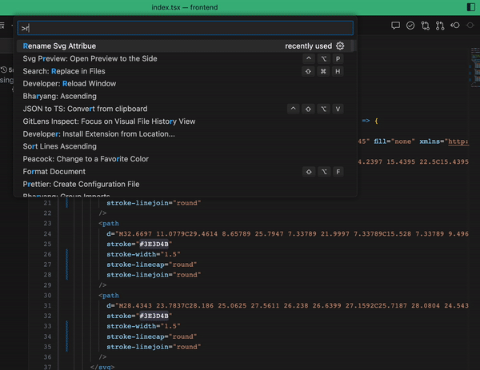

# SVG Attribute to CamelCase Extension for Visual Studio Code

## Description

The SVG Attribute to CamelCase extension for Visual Studio Code allows you to quickly and easily convert SVG attributes with hyphens in their keys to their corresponding camelCase versions. When working with SVG files, you might encounter attributes like stroke-linecap, stroke-linejoin, fill-opacity, and more, which use hyphens to separate words. However, in JSX syntax or React components, it's more common to use camelCase for attribute names, like strokeLinecap, strokeLinejoin, fillOpacity, etc. This extension simplifies the conversion process and helps maintain consistent naming conventions in your SVG files.

## Features

- Replaces all SVG attributes with hyphens in their keys with their corresponding camelCase versions.
- Supports a wide range of SVG attributes, including those commonly used with the path element and other SVG elements.
- Works seamlessly with XML and SVG files in Visual Studio Code.
- Allows you to apply the attribute conversion with a single command or keybinding.

## How to Use



1. Install the "SVG Attribute to CamelCase" extension from the Visual Studio Code Marketplace.
2. Open an XML or SVG file in the Visual Studio Code editor.
3. Place the cursor inside the file, or make sure the file is in focus.
4. Use one of the following methods to replace the attributes:
5. Execute the "Replace attributes with camelCase" command from the command palette (Ctrl+Shift+P or Cmd+Shift+P on macOS) or the right-click context menu.
6. Use the provided keybinding (Ctrl+Shift+R or Cmd+Shift+R on macOS) to quickly replace the attributes.

## Example

Before applying the extension:

### Copy code

```
<svg width="100" height="100" viewBox="0 0 100 100" xmlns="http://www.w3.org/2000/svg">
<path d="M10 20 L30 40" stroke-linecap="round" fill-opacity="0.5" />
</svg>
```

After applying the extension:

Ctrl + p > Rename Svg Attribue

### xml

Copy code

```
<svg width="100" height="100" viewBox="0 0 100 100" xmlns="http://www.w3.org/2000/svg">
<path d="M10 20 L30 40" strokeLinecap="round" fillOpacity="0.5" />
</svg>
```

## Contributions and Issues

Contributions and bug reports are welcome! If you encounter any issues or have suggestions for improvements, please create a GitHub issue at https://github.com/admondtamang/svg-renamer-vscode

## License

This extension is released under the MIT License.
